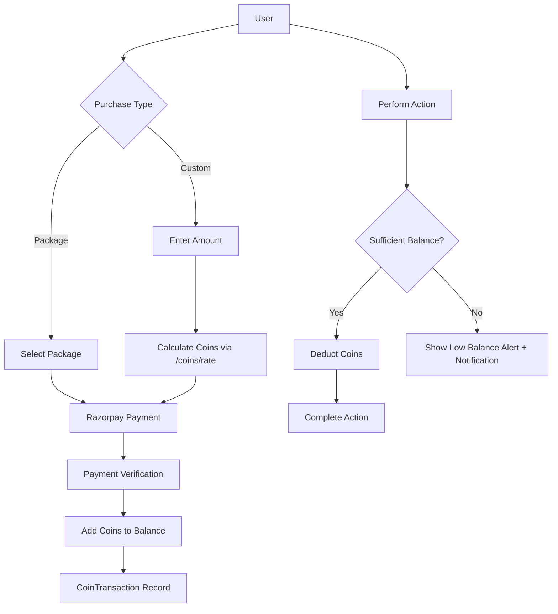

# Shramik Coin System & Razorpay Payment Documentation

## Overview

Shramik uses a **virtual coin-based payment system** where users (Job Seekers & Recruiters) purchase coins with real money via **Razorpay** and spend coins to perform actions like applying for jobs or posting job listings.

### Two Ways to Purchase Coins

1. **Fixed Packages**: Admin-defined bundles (e.g., "Basic Pack - 100 coins for ₹90")
2. **Custom Amount**: User enters any INR amount, coins calculated using `baseAmount` and `baseCoins` rate

---

## System Architecture



---

## Custom Amount Pricing Model

### Simple 2-Field Configuration

Instead of a complex "coins per rupee" rate, we use a simple reference-based model:

| Field | Example | Meaning |
|-------|---------|---------|
| `baseAmount` | 100 | Reference amount in ₹ |
| `baseCoins` | 150 | Coins given for that amount |

### Calculation Formula

```
coinsToReceive = (userAmount / baseAmount) × baseCoins
```

**Examples** (with baseAmount=100, baseCoins=150):
- ₹100 → 150 coins
- ₹200 → 300 coins
- ₹500 → 750 coins
- ₹1000 → 1500 coins

---

## Database Models

### 1. CoinPackage (`coinPricing.model.js`)
Predefined coin bundles set by admin.

| Field | Type | Description |
|-------|------|-------------|
| `category` | String | `"jobSeeker"` or `"recruiter"` |
| `name` | String | Package name (e.g., "Starter Pack") |
| `coins` | Number | Number of coins in package |
| `price.amount` | Number | Price in INR |
| `price.currency` | String | Default: `"INR"` |
| `isVisible` | Boolean | Show/hide from users |

### 2. CoinRule (`coinPricing.model.js`)
Pricing rates and action costs.

| Field | Type | Description |
|-------|------|-------------|
| `category` | String | `"jobSeeker"` or `"recruiter"` |
| `baseAmount` | Number | Base amount in ₹ (e.g., 100) |
| `baseCoins` | Number | Coins for that amount (e.g., 150) |
| `coinCostPerApplication` | Number | Coins to apply for a job |
| `coinCostPerJobPost` | Number | Coins to post a job |
| `coinPerEmployeeCount` | Number | Additional cost per employee |

### 3. CoinTransaction (`coinTransaction.model.js`)
Records all coin movements.

| Field | Type | Description |
|-------|------|-------------|
| `userId` | ObjectId | User reference |
| `userType` | String | `"job-seeker"` or `"recruiter"` |
| `transactionType` | String | `"purchase"`, `"deduction"`, `"refund"` |
| `amount` | Number | Coins added/deducted |
| `price` | Number | INR amount (for purchases) |
| `razorpayOrderId` | String | Razorpay order ID |
| `razorpayPaymentId` | String | Razorpay payment ID |
| `razorpaySignature` | String | Verification signature |
| `status` | String | `"pending"`, `"success"`, `"failed"` |
| `description` | String | Transaction description |
| `balanceAfter` | Number | Balance after transaction |

---

## Complete Payment Flow

### For Mobile App / Frontend

```
┌─────────────────────────────────────────────────────────────────┐
│                    COIN PURCHASE FLOW                           │
├─────────────────────────────────────────────────────────────────┤
│                                                                 │
│  Step 1: Get Rate (for custom amount)                          │
│  ─────────────────────────────────────                          │
│  GET /api/job-seekers/coins/rate                                │
│  Response: { baseAmount: 100, baseCoins: 150 }                  │
│                                                                 │
│  Step 2: Calculate Coins                                        │
│  ───────────────────────                                        │
│  GET /api/job-seekers/coins/calculate?amount=500                │
│  Response: { amount: 500, coinsToReceive: 750 }                 │
│                                                                 │
│  Step 3: Create Razorpay Order (Mobile SDK)                     │
│  ──────────────────────────────────────────                     │
│  Razorpay.open({                                                │
│    key: 'rzp_test_XXX',                                         │
│    amount: 50000, // ₹500 in paise                              │
│    currency: 'INR'                                              │
│  });                                                            │
│                                                                 │
│  Step 4: User Completes Payment                                 │
│  ─────────────────────────────                                  │
│  Razorpay returns: orderId, paymentId, signature                │
│                                                                 │
│  Step 5: Verify Payment & Add Coins                             │
│  ──────────────────────────────────                             │
│  POST /api/job-seekers/payment/                                 │
│  Body: { amount: 500, razorpayOrderId, paymentId, signature }   │
│  Response: { coinsAdded: 750, currentBalance: 850 }             │
│                                                                 │
└─────────────────────────────────────────────────────────────────┘
```

---

## API Endpoints

### Job Seeker Coin APIs

**Base URL:** `/api/job-seekers/coins/`

| Method | Endpoint | Description |
|--------|----------|-------------|
| GET | `/balance` | Get current coin balance |
| GET | `/transactions` | Get transaction history |
| GET | `/packages` | Get available coin packages |
| GET | `/packages/:packageId` | Get specific package |
| GET | `/rate` | **Get baseAmount & baseCoins** |
| GET | `/calculate?amount=500` | **Calculate coins for custom amount** |

### Job Seeker Payment API

**Endpoint:** `POST /api/job-seekers/payment/`

**For Package Purchase:**
```json
{
    "packageId": "package_object_id",
    "razorpayOrderId": "order_XXXXXX",
    "razorpayPaymentId": "pay_XXXXXX",
    "razorpaySignature": "signature_hash"
}
```

**For Custom Amount Purchase:**
```json
{
    "amount": 500,
    "razorpayOrderId": "order_XXXXXX",
    "razorpayPaymentId": "pay_XXXXXX",
    "razorpaySignature": "signature_hash"
}
```

**Response:**
```json
{
    "success": true,
    "data": {
        "transactionId": "txn_abc123",
        "coinsAdded": 750,
        "currentBalance": 850
    }
}
```

### Recruiter Coin APIs

Same as Job Seeker, replace `job-seekers` with `recruiters`:
- `/api/recruiters/coins/rate`
- `/api/recruiters/coins/calculate?amount=500`
- `/api/recruiters/payment/`

### Admin Coin Pricing APIs

**Base URL:** `/api/coin-pricing/:category`

| Method | Endpoint | Description |
|--------|----------|-------------|
| GET | `/` | Get packages & rules |
| POST | `/packages` | Create new package |
| PUT | `/packages/:packageId` | Update package |
| DELETE | `/packages/:packageId` | Delete package |
| PUT | `/rules` | Update pricing rules |

**Update Rules Body:**
```json
{
    "baseAmount": 100,
    "baseCoins": 150,
    "coinCostPerApplication": 5,
    "coinCostPerJobPost": 10
}
```

---

## Payment Verification Process

```javascript
// 1. IDEMPOTENCY CHECK - Prevent duplicate processing
const existingTxn = await CoinTransaction.findOne({ razorpayPaymentId });
if (existingTxn) return "Already processed";

// 2. SIGNATURE VERIFICATION - Validate Razorpay signature
const expectedSignature = crypto
    .createHmac("sha256", process.env.RAZORPAY_KEY_SECRET)
    .update(`${razorpayOrderId}|${razorpayPaymentId}`)
    .digest("hex");

if (expectedSignature !== razorpaySignature) {
    throw new ApiError(400, "Invalid payment signature");
}

// 3. CALCULATE COINS
let coinsToAdd, priceAmount, description;

if (packageId) {
    // Package purchase
    const package = await CoinPackage.findById(packageId);
    coinsToAdd = package.coins;
    priceAmount = package.price.amount;
} else {
    // Custom amount purchase
    const rule = await CoinRule.findOne({ category });
    coinsToAdd = Math.floor((amount / rule.baseAmount) * rule.baseCoins);
    priceAmount = amount;
}

// 4. ATOMIC UPDATE - Using MongoDB session
const session = await mongoose.startSession();
session.startTransaction();

// Update user balance
await User.findByIdAndUpdate(userId, { $inc: { coinBalance: coinsToAdd } }, { session });

// Create transaction record
await CoinTransaction.create([{ ... }], { session });

await session.commitTransaction();
```

---

## Razorpay Configuration

### Environment Variables
```env
RAZORPAY_KEY_ID=rzp_test_XXXXXXXXXXXX
RAZORPAY_KEY_SECRET=XXXXXXXXXXXXXXXXXXXXXXXX
```

### Config File (`config/razorpay.js`)
```javascript
import Razorpay from "razorpay";

export const razorpay = new Razorpay({
    key_id: process.env.RAZORPAY_KEY_ID,
    key_secret: process.env.RAZORPAY_KEY_SECRET,
});
```

---

## Core Service Functions (`coinService.js`)

| Function | Description |
|----------|-------------|
| `getCoinBalance(userId, userType)` | Get current balance |
| `checkCoinBalance(userId, userType, required)` | Check if user has enough coins |
| `deductCoins(...)` | Deduct coins for action (atomic) |
| `addCoins(...)` | Add coins after purchase (atomic) |
| `refundCoins(...)` | Refund coins to user |
| `getTransactionHistory(...)` | Paginated transaction list |

---

## Security Features

| Feature | Description |
|---------|-------------|
| Signature Verification | HMAC SHA256 signature validation |
| Idempotency | Duplicate payment detection |
| Race Condition Protection | Double-check inside MongoDB session |
| Atomic Transactions | All-or-nothing database updates |
| JWT Authentication | All endpoints require valid tokens |

---

## Error Handling

| Error | Code | Description |
|-------|------|-------------|
| Invalid payment signature | 400 | Razorpay signature mismatch |
| Package not found | 404 | Selected package doesn't exist |
| Insufficient balance | 400 | Not enough coins for action |
| Either packageId or amount required | 400 | Missing purchase details |
| Already processed | 200 | Payment already fulfilled (idempotent) |

---

## Low Balance Notifications

When a user's balance drops below **10 coins**, they receive a push notification:

- **Job Seeker**: "You only have X coins left! Recharge now to apply for more jobs."
- **Recruiter**: "Low balance! You need more coins to post jobs."

---

## File Structure

```
src/
├── config/
│   └── razorpay.js                    # Razorpay config
├── models/
│   ├── admin/coinPricing/
│   │   └── coinPricing.model.js       # CoinPackage, CoinRule
│   └── coin/
│       └── coinTransaction.model.js   # CoinTransaction
├── validation/
│   └── admin/coinPricing/
│       └── coinPricing.validation.js  # Joi schemas (includes baseAmount, baseCoins)
├── services/
│   └── coin/
│       └── coinService.js             # Core coin operations
├── controllers/
│   ├── admin/coinPricing/
│   │   └── coinPricing.controller.js  # Admin CRUD
│   ├── jobSeeker/
│   │   ├── coin.controller.js         # rate, calculate, balance
│   │   └── jobSeeker.payment.controller.js
│   └── recruiter/
│       ├── coin.controller.js
│       └── recruiter.payment.controller.js
└── routes/
    ├── admin/coinPricing/
    │   └── coinPricing.routes.js
    ├── jobSeeker/
    │   ├── coin.routes.js
    │   └── payment.routes.js
    └── recruiter/
        ├── coin.routes.js
        └── payment.routes.js
```

---

## Quick API Test (Postman)

### 1. Get Rate
```
GET /api/job-seekers/coins/rate
Authorization: Bearer <token>
```

### 2. Calculate Coins
```
GET /api/job-seekers/coins/calculate?amount=500
Authorization: Bearer <token>
```

### 3. Verify Payment
```
POST /api/job-seekers/payment/
Authorization: Bearer <token>
Body: { "amount": 500, "razorpayOrderId": "...", ... }
```

### 4. Admin Update Rules
```
PUT /api/coin-pricing/jobSeeker/rules
Authorization: Bearer <admin_token>
Body: { "baseAmount": 100, "baseCoins": 200 }
```
