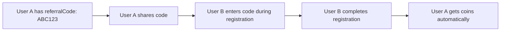

# Referral System - Developer Documentation

## Overview

The referral system allows users to share their unique referral code. When a new user signs up using someone's referral code, the referrer earns coins.

---

## How It Works



1. **Every user gets a unique 8-character referral code** on first login/registration
2. User A shares their code with User B
3. User B enters the code during **registration** (not OTP verification)
4. After User B completes registration, User A receives coins (configured by admin)

---

## API Endpoints for Flutter

### 1. Get User's Referral Code (after login)

The `referralCode` is returned in the `verifyOTP` response:

```json
{
  "user": {
    "_id": "...",
    "referralCode": "ABC123XY",
    "coinBalance": 100
  }
}
```

### 2. Get Referral Code & Stats

**Job Seeker:**
```http
GET /api/job-seekers/coins/referral/my-code
Authorization: Bearer <access_token>
```

**Recruiter:**
```http
GET /api/recruiters/coins/referral/my-code
Authorization: Bearer <access_token>
```

**Response:**
```json
{
  "success": true,
  "data": {
    "referralCode": "ABC123XY",
    "shareMessage": "Join Shramik and get free coins! Use my referral code: ABC123XY"
  }
}
```

### 3. Get Referral Stats

**Job Seeker:**
```http
GET /api/job-seekers/coins/referral/stats
Authorization: Bearer <access_token>
```

**Response:**
```json
{
  "success": true,
  "data": {
    "referralCode": "ABC123XY",
    "totalReferrals": 5,
    "rewardedReferrals": 5,
    "totalCoinsEarned": 250,
    "coinsPerReferral": 50,
    "maxReferrals": "Unlimited",
    "referrals": [
      {
        "id": "...",
        "refereePhone": "9876543210",
        "coinsAwarded": 50,
        "status": "rewarded",
        "createdAt": "2024-01-15T10:30:00Z"
      }
    ]
  }
}
```

---

## Sending Referral Code During Registration

Send `referralCode` in the **registration API body** (NOT in verifyOTP):

### Recruiter Registration

```http
POST /api/recruiters/register
Content-Type: multipart/form-data

{
  "phone": "9876543210",
  "recruiterId": "...",
  "name": "Test Recruiter",
  "companyName": "Test Company",
  "email": "test@example.com",
  "referralCode": "ABC123XY"  // Optional
}
```

### Job Seeker - Non-Degree Registration

```http
POST /api/job-seekers/register-non-degree
Content-Type: multipart/form-data

{
  "phone": "9876543210",
  "name": "Test User",
  "email": "test@example.com",
  "gender": "male",
  "dateOfBirth": "1995-01-15",
  "stateId": "...",
  "cityId": "...",
  "specializationId": "...",
  "selectedSkills": ["Skill1", "Skill2"],
  "referralCode": "ABC123XY"  // Optional
}
```

### Job Seeker - Diploma/ITI Step 1 Registration

```http
POST /api/job-seekers/step1
Content-Type: multipart/form-data

{
  "phone": "9876543210",
  "name": "Test User",
  "email": "test@example.com",
  "gender": "male",
  "dateOfBirth": "1995-01-15",
  "referralCode": "ABC123XY"  // Optional
}
```

---

## Postman Testing Flow

### Step 1: Create User A (Referrer)

```http
POST /api/auth/send-otp
{
  "phone": "9999900001",
  "category": "Non-Degree Holder"
}
```

```http
POST /api/auth/verify-otp
{
  "phone": "9999900001",
  "otp": "1234",
  "category": "Non-Degree Holder"
}
```

**Save the `referralCode` from response** (e.g., `ABC123XY`)

### Step 2: Create User B with Referral Code

```http
POST /api/auth/send-otp
{
  "phone": "9999900002",
  "category": "Non-Degree Holder"
}
```

```http
POST /api/auth/verify-otp
{
  "phone": "9999900002",
  "otp": "1234",
  "category": "Non-Degree Holder"
}
```

```http
POST /api/job-seekers/register-non-degree
Content-Type: multipart/form-data

phone: 9999900002
name: Test User B
email: testb@example.com
gender: male
dateOfBirth: 1995-01-15
stateId: <valid_state_id>
cityId: <valid_city_id>
specializationId: <valid_specialization_id>
selectedSkills: ["Skill1"]
referralCode: ABC123XY      // User A's code
aadhaarCard: <file>
profilePhoto: <file>
```

### Step 3: Verify User A Got Coins

```http
GET /api/job-seekers/coins/balance
Authorization: Bearer <user_a_token>
```

Check `coinBalance` increased!

---

## Admin API - Set Referral Coins

```http
PUT /api/coin-pricing/jobSeeker/rules
Authorization: Bearer <admin_token>
Content-Type: application/json

{
  "referralSettings": {
    "isEnabled": true,
    "referrerCoins": 100,
    "maxReferralsPerUser": 50
  }
}
```

---

## Response After Successful Referral

Registration API returns referral info:

```json
{
  "success": true,
  "data": {
    "jobSeeker": { ... },
    "referral": {
      "referredBy": "user_a_id",
      "referrerType": "JobSeeker",
      "referrerCoinsAwarded": 50
    }
  }
}
```

---

## Error Handling

| Scenario | Behavior |
|----------|----------|
| Invalid referral code | Ignored, registration proceeds |
| User already referred | Ignored, no duplicate rewards |
| Referral system disabled | No rewards, registration proceeds |
| Max referrals reached | No reward for referrer |
